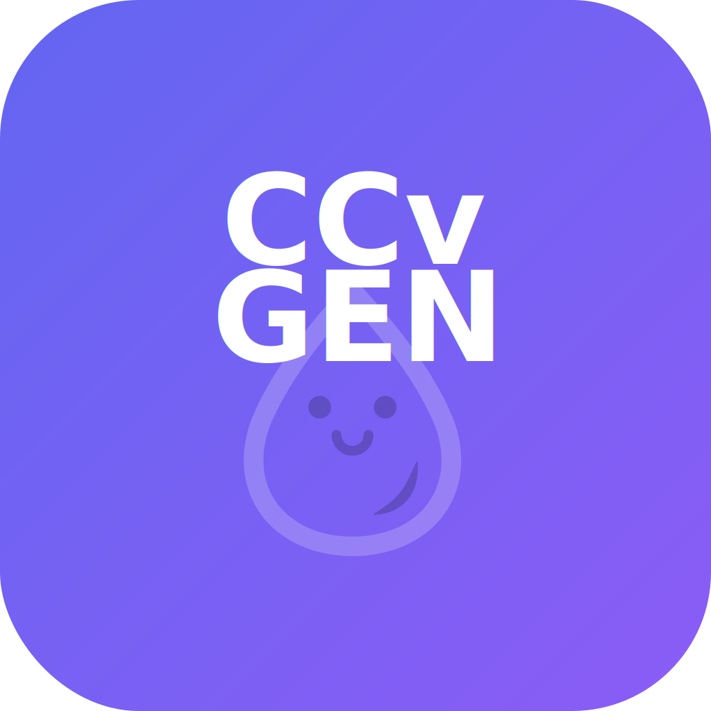

# CCvGEN - RISU AI Character Card Generator

<p align="center">
  
</p>

<p align="center">
  <strong>🎭 AI-Powered Character Card Generator for RISU AI</strong><br>
  Create high-quality character cards with a systematic 5-stage workflow
</p>

<p align="center">
  <a href="#features">Features</a> •
  <a href="#installation">Installation</a> •
  <a href="#usage">Usage</a> •
  <a href="#api-setup">API Setup</a> •
  <a href="#development">Development</a> •
  <a href="#license">License</a>
</p>

---

## 📖 Introduction

CCvGEN is a desktop application that automatically generates character cards for the RISU AI platform using various AI models (OpenAI, Claude, Gemini, etc.). With an intuitive 5-stage workflow, anyone can easily create professional-level characters.

## ✨ Features

### 🤖 Multi-AI Model Support
- **OpenAI**: GPT-4.1, GPT-4o series
- **Anthropic**: Claude Opus 4, Claude Sonnet series
- **Google**: Gemini 2.5 Pro, Flash series
- **Local Models**: Ollama, LM Studio
- **Custom Endpoints**: OpenAI-compatible APIs

### 🔄 5-Stage Systematic Workflow
1. **API Setup**: Select and authenticate AI provider
2. **Character Input**: Basic info and asset upload
3. **AI Generation**: Automatic content generation
4. **Review/Edit**: Real-time editing and preview
5. **Export**: CHARX format output

### 🎨 Smart Asset Management
- Automatic image classification (emotion/background/items)
- AI-based automatic file naming
- Multiple format support (JPG, PNG, WebP, GIF)
- Batch processing capabilities

### ⚙️ Advanced Features
- Custom prompt templates
- Real-time preview
- Metadata management
- Multi-language character generation

## 📦 Installation

### 🚀 Quick Install (Recommended)

Download the latest release from [GitHub Releases](https://github.com/LTXY12/CCvGEN/releases):

| Platform | Filename | Requirements |
|----------|----------|--------------|
| macOS (Apple Silicon) | `CCvGEN_1.0.0_aarch64.dmg` | macOS 11.0+ |
| macOS (Intel) | `CCvGEN_1.0.0_x64.dmg` | macOS 10.15+ |
| Windows | `CCvGEN_1.0.0_x64_en-US.msi` | Windows 10+ |
| Linux | `CCvGEN_1.0.0_amd64.AppImage` | Ubuntu 20.04+ |

### 🔨 Build from Source

#### Prerequisites
- Node.js 18.0+
- Rust 1.70+
- Git

#### Build Steps

```bash
# 1. Clone repository
git clone https://github.com/LTXY12/CCvGEN.git
cd CCvGEN

# 2. Install dependencies
npm install

# 3. Run development server (optional)
npm run dev

# 4. Production build
./build.sh    # macOS/Linux
build.bat     # Windows
```

## 🎯 Usage

### Getting Started

1. **Launch App**: Run the downloaded application
2. **Setup API**: Select AI service and enter API key
3. **Create Character**: Follow the 5-stage workflow
4. **Export**: Save as CHARX file

### Detailed Workflow

#### 📍 Stage 1: API Setup
```
- Select AI provider
- Enter API key
- Choose model
- Test connection
```

#### 📍 Stage 2: Character Input
```
Basic Information:
- Name, age, gender
- Basic description
- Tags and categories

Asset Upload:
- Profile image
- Emotion expression sets
- Background images
```

#### 📍 Stage 3: AI Generation
```
Generation Options:
- Personality traits
- Background story
- Dialogue style
- Scenario settings
```

#### 📍 Stage 4: Review & Edit
```
- Review generated content
- Real-time editing
- Asset adjustment
```

#### 📍 Stage 5: Export
```
- CHARX format output
- Asset inclusion options
- Ready for RISU AI import
```

## 🔑 API Setup

### OpenAI
```yaml
Provider: OpenAI
Endpoint: https://api.openai.com/v1
Models: gpt-4.1, gpt-4o, gpt-4o-mini
Get API Key: https://platform.openai.com/api-keys
```

### Anthropic Claude
```yaml
Provider: Anthropic
Endpoint: https://api.anthropic.com/v1
Models: claude-opus-4, claude-sonnet-4, claude-3-5-sonnet
Get API Key: https://console.anthropic.com/
```

### Google Gemini
```yaml
Provider: Google
Endpoint: https://generativelanguage.googleapis.com/v1
Models: gemini-2.5-pro, gemini-2.5-flash, gemini-2.0-flash
Get API Key: https://makersuite.google.com/app/apikey
```

### Ollama (Local)
```yaml
Provider: Ollama
Endpoint: http://localhost:11434
Models: llama3.3, qwen2.5, mistral
Installation: https://ollama.ai/
```

### LM Studio (Local)
```yaml
Provider: LM Studio
Endpoint: http://localhost:1234/v1
Models: User-installed models
Installation: https://lmstudio.ai/
```

## 🛠 Development

### Tech Stack

| Layer | Technology |
|-------|------------|
| Frontend | React 18 + TypeScript + Vite |
| Backend | Rust + Tauri 2.0 |
| UI | Tailwind CSS |
| State | React Hooks |
| Build | Tauri Builder |

### Project Structure

```
CCvGEN/
├── src/                    # React frontend
│   ├── components/         # UI components
│   ├── api/               # API integration
│   ├── core/              # Core logic
│   └── utils/             # Utilities
├── src-tauri/             # Rust backend
│   ├── src/               # Rust source
│   ├── icons/             # App icons
│   └── Cargo.toml         # Rust dependencies
├── dist/                  # Build output
├── package.json           # Node dependencies
└── tauri.conf.json        # Tauri configuration
```

### Development Commands

```bash
# Development server
npm run dev

# Tauri development mode
npm run tauri dev

# Frontend build
npm run build

# Desktop app build
npm run tauri build

# Run tests
npm test

# Lint check
npm run lint

# Clean build
./cleanup.sh
```

## 📋 System Requirements

### Minimum Requirements
- **OS**: Windows 10, macOS 10.15, Ubuntu 20.04
- **CPU**: Dual-core 2GHz
- **RAM**: 4GB
- **Storage**: 500MB free space
- **Internet**: Required for API communication

### Recommended
- **CPU**: Quad-core 3GHz
- **RAM**: 8GB+
- **Storage**: 1GB+ free space
- **Internet**: Broadband connection

## 🔒 Security & Privacy

- ✅ API keys stored locally only
- ✅ No data transmission to external servers
- ✅ All processing done locally
- ✅ Open source code for verification

## 🐛 Troubleshooting

### Common Issues

**Q: API connection failed**
```
A: Check your API key and endpoint.
   Firewall settings may need to be verified.
```

**Q: Image upload failed**
```
A: Ensure supported format (JPG, PNG, WebP, GIF).
   File size must be under 10MB.
```

**Q: Build error**
```
A: Verify Node.js and Rust are up to date.
   Try running npm install again.
```

## 📄 License

MIT License - Free to use, modify, and distribute.
See [LICENSE](LICENSE) file for details.

## 🤝 Contributing

Join us in improving the project!

1. Fork the repository
2. Create feature branch (`git checkout -b feature/NewFeature`)
3. Commit changes (`git commit -m 'Add NewFeature'`)
4. Push to branch (`git push origin feature/NewFeature`)
5. Open Pull Request

### Contribution Areas
- 🐛 Bug fixes
- ✨ New features
- 📝 Documentation improvements
- 🌐 Translations
- 🎨 UI/UX improvements

## 👏 Acknowledgments

- [RISU AI](https://risu.ai) - Character card format specification
- [Tauri](https://tauri.app) - Cross-platform framework
- [OpenAI](https://openai.com), [Anthropic](https://anthropic.com), [Google](https://ai.google) - AI API providers
- All open source contributors

## 📧 Contact

- **Issue Tracker**: [GitHub Issues](https://github.com/LTXY12/CCvGEN/issues)
- **Project Home**: [https://github.com/LTXY12/CCvGEN](https://github.com/LTXY12/CCvGEN)
- **Developer**: [@LTXY12](https://github.com/LTXY12)

---

<p align="center">
  Made with ❤️ by LTXY12<br>
  © 2024 CCvGEN. All rights reserved.
</p>